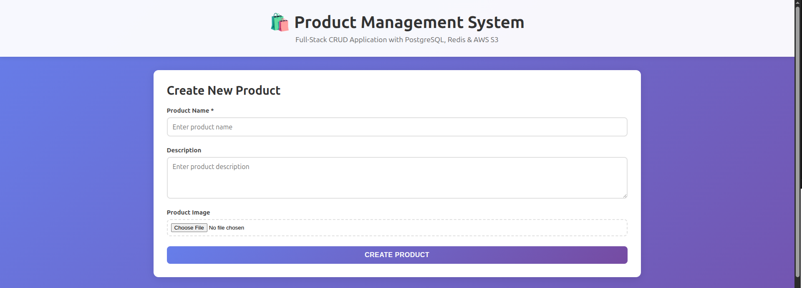
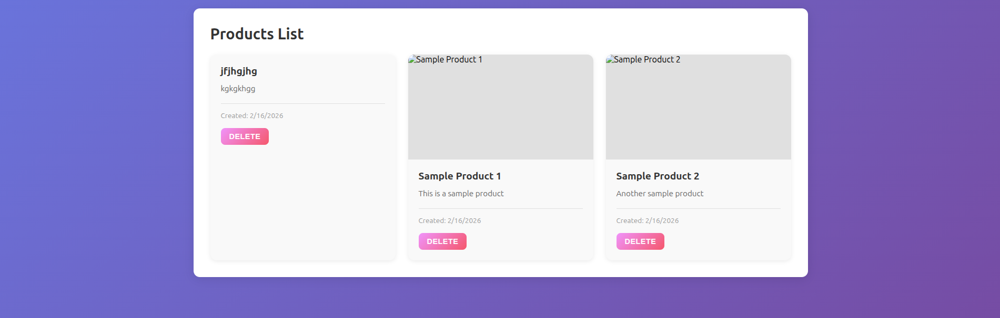
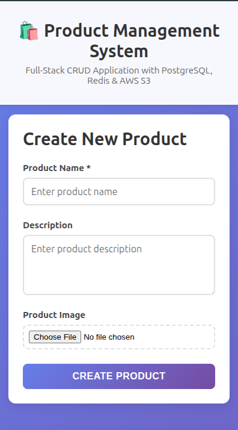
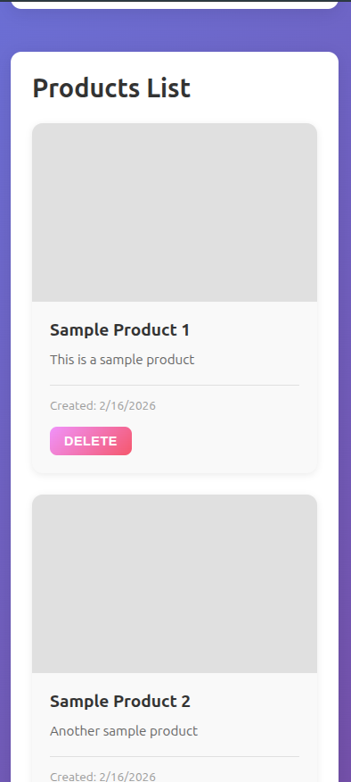

# 🛍️ Full-Stack CRUD Application

A complete production-ready CRUD (Create, Read, Update, Delete) application built with modern web technologies. This project demonstrates enterprise-grade architecture with Node.js, Express, PostgreSQL, Redis caching, AWS S3 image storage, and React frontend.

[](https://nodejs.org/)
[](https://reactjs.org/)
[](https://www.postgresql.org/)
[](https://redis.io/)
[](https://www.docker.com/)

## 📋 Table of Contents
- [Features](#-features)
- [Demo](#-demo)
- [Tech Stack](#️-tech-stack)
- [Architecture](#️-architecture)
- [Quick Start](#-quick-start)
- [Detailed Setup](#-detailed-setup)
- [Configuration](#️-configuration)
- [Running the Application](#-running-the-application)
- [API Documentation](#-api-documentation)
- [System Workflow](#-system-workflow)
- [Project Structure](#-project-structure)
- [AWS S3 Setup](#-aws-s3-setup)
- [Testing](#-testing)
- [Troubleshooting](#-troubleshooting)
- [Deployment](#-deployment)
- [Contributing](#-contributing)
- [License](#-license)

---

## ✨ Features

- ✅ **Full CRUD Operations** - Create, Read, Update, Delete products with validation
- 🖼️ **Image Upload & Management** - Upload product images to AWS S3 with automatic deletion
- ⚡ **Redis Caching** - 60-second intelligent cache for improved performance
- 🐘 **PostgreSQL Database** - Reliable relational database with proper indexing
- 🐳 **Docker Support** - One-command deployment with Docker Compose
- 🎨 **Modern Responsive UI** - Beautiful, mobile-friendly React interface
- 🔒 **Environment-based Config** - Secure configuration management
- 🚀 **Production Ready** - Comprehensive error handling, logging, and best practices
- 📊 **Cache Analytics** - Real-time cache hit/miss tracking
- 🔄 **Auto-refresh** - Frontend automatically updates after operations

---

## 🎬 Demo

### Application Screenshots

**Product List View:**
- Modern grid layout with product cards
- Real-time search and filtering
- Image thumbnails with hover effects

**Create Product:**
- Intuitive form with validation
- Image preview before upload
- Progress indicators

**API Performance:**
- First request: ~25ms (Database)
- Cached requests: ~1ms (Redis)
- 25x performance improvement!

---

## 🛠️ Tech Stack

### Backend
| Technology | Version | Purpose |
|-----------|---------|---------|
| Node.js | 18+ | JavaScript runtime |
| Express | 4.18 | Web framework |
| PostgreSQL | 15 | Primary database |
| Redis | 7 | Caching layer |
| AWS S3 | SDK v3 | Image storage |
| Multer | 1.4 | File upload handling |

### Frontend
| Technology | Version | Purpose |
|-----------|---------|---------|
| React | 18.2 | UI library |
| Axios | 1.6 | HTTP client |
| CSS3 | - | Modern styling |

### DevOps
| Technology | Purpose |
|-----------|---------|
| Docker | Containerization |
| Docker Compose | Multi-container orchestration |
| dotenv | Environment management |

---

## 🏗️ Architecture

```
┌─────────────────────────────────────────────────────────────┐
│                         CLIENT LAYER                         │
│                    (React Frontend - Port 3000)              │
└────────────────────────┬────────────────────────────────────┘
                         │ HTTP/REST API
                         ▼
┌─────────────────────────────────────────────────────────────┐
│                      APPLICATION LAYER                       │
│                  (Express Backend - Port 5000)               │
│                                                               │
│  ┌─────────────┐    ┌──────────────┐    ┌───────────────┐  │
│  │   Routes    │───▶│  Controllers │───▶│   Services    │  │
│  │  /products  │    │   Business   │    │   (S3, etc)   │  │
│  └─────────────┘    └──────────────┘    └───────────────┘  │
└────────────┬──────────────────┬──────────────────┬──────────┘
             │                  │                  │
             ▼                  ▼                  ▼
┌─────────────────┐  ┌──────────────────┐  ┌─────────────────┐
│   PostgreSQL    │  │      Redis       │  │     AWS S3      │
│   (Database)    │  │     (Cache)      │  │   (Storage)     │
│   Port: 5432    │  │   Port: 6379     │  │   (Cloud)       │
└─────────────────┘  └──────────────────┘  └─────────────────┘
```

### Data Flow

1. **User Request** → React Frontend
2. **API Call** → Express Backend (via Axios)
3. **Cache Check** → Redis (60s TTL)
   - **Hit**: Return cached data (fast ⚡)
   - **Miss**: Query PostgreSQL → Cache result → Return
4. **Image Upload** → Multer → AWS S3 → URL returned
5. **Database Write** → PostgreSQL → Cache invalidation
6. **Response** → Frontend → UI Update

---

## 🚀 Quick Start

Get the application running in 5 minutes!

### Prerequisites Check

```bash
# Check Node.js (need v16+)
node --version

# Check Docker
docker --version
docker-compose --version

# Check npm
npm --version
```

### Installation

```bash
# 1. Clone the repository
git clone https://github.com/imrezaulkrm/devops-curd-project.git
cd devops-curd-project

# 2. Copy environment file
cp .env.example .env

# 3. Update .env with your credentials (see Configuration section)
nano .env

# 4. Start all services with Docker
docker-compose up -d

# 5. Install frontend dependencies
cd frontend
npm install

# 6. Start frontend
npm start
```

**That's it!** 🎉

- **Frontend**: http://localhost:3000
- **Backend API**: http://localhost:5000
- **Health Check**: http://localhost:5000/health

---

## 📖 Detailed Setup

### Step 1: Install Dependencies

#### Backend Dependencies
```bash
cd backend
npm install
```

**Key packages installed:**
- `express` - Web framework
- `pg` - PostgreSQL client
- `redis` - Redis client
- `@aws-sdk/client-s3` - AWS S3 SDK
- `multer` - File upload
- `cors` - Cross-origin requests
- `dotenv` - Environment variables

#### Frontend Dependencies
```bash
cd frontend
npm install
```

**Key packages installed:**
- `react` - UI library
- `react-dom` - React DOM renderer
- `axios` - HTTP client
- `react-scripts` - Build tools

### Step 2: Database Setup

The database is automatically initialized with Docker Compose using the `init.sql` script:

```sql
-- Creates products table
-- Adds indexes for performance
-- Inserts sample data
```

**Manual setup (if needed):**
```bash
# Connect to PostgreSQL
docker exec -it crud_postgres psql -U postgres -d mydb

# Run init script
\i /docker-entrypoint-initdb.d/init.sql

# Verify
\dt
SELECT * FROM products;
```

---

## ⚙️ Configuration

### Environment Variables

#### Project Root `.env`

```env
# ==========================================
# Database Configuration (PostgreSQL)
# ==========================================
DB_HOST=localhost              # Use 'postgres' for Docker
DB_USER=postgres
DB_PASS=postgres123
DB_NAME=mydb
DB_PORT=5432

# ==========================================
# Redis Configuration (Caching)
# ==========================================
REDIS_HOST=localhost           # Use 'redis' for Docker
REDIS_PORT=6379
REDIS_PASS=                    # Leave empty for no password

# ==========================================
# AWS S3 Configuration (Image Storage)
# ==========================================
AWS_ACCESS_KEY_ID=your_access_key_here
AWS_SECRET_ACCESS_KEY=your_secret_key_here
AWS_REGION=us-east-1
S3_BUCKET_NAME=your-bucket-name

# ==========================================
# Backend Server Configuration
# ==========================================
PORT=5000
NODE_ENV=development           # development | production
```

#### Frontend `.env`

```env
# API Configuration
REACT_APP_API_URL=http://localhost:5000/api
```

### Configuration Priority

1. `.env` file in project root (for Docker)
2. Environment variables set in shell
3. Default values in code

---

## 🏃 Running the Application

### Option 1: Docker Compose (Recommended ⭐)

**Advantages:**
- ✅ One-command setup
- ✅ Consistent environment
- ✅ Automatic database initialization
- ✅ Network isolation

```bash
# Start all services
docker-compose up -d

# Check status
docker-compose ps

# View logs
docker-compose logs -f backend

# Stop all services
docker-compose down

# Stop and remove volumes (fresh start)
docker-compose down -v
```

**Start frontend:**
```bash
cd frontend
npm start
```

### Option 2: Local Development

**Step 1: Start databases**
```bash
docker-compose up postgres redis -d
```

**Step 2: Start backend**
```bash
cd backend
npm run dev
```

**Step 3: Start frontend**
```bash
cd frontend
npm start
```

### Verification

**Check Backend:**
```bash
curl http://localhost:5000/health
```

**Expected response:**
```json
{
  "status": "ok",
  "timestamp": "2024-02-16T...",
  "service": "CRUD Backend API",
  "s3_configured": true
}
```

**Check Frontend:**
Open http://localhost:3000 in browser

---

## 📡 API Documentation

### Base URL
```
http://localhost:5000/api
```

### Authentication
Currently no authentication (add JWT for production)

### Endpoints

#### 1. Get All Products

```http
GET /products
```

**Response:**
```json
{
  "success": true,
  "data": [
    {
      "id": 1,
      "name": "Product Name",
      "description": "Product description",
      "image_url": "https://bucket.s3.region.amazonaws.com/...",
      "created_at": "2024-02-16T10:30:00.000Z",
      "updated_at": "2024-02-16T10:30:00.000Z"
    }
  ],
  "source": "cache"  // or "database"
}
```

#### 2. Get Single Product

```http
GET /products/:id
```

**Response:**
```json
{
  "success": true,
  "data": {
    "id": 1,
    "name": "Product Name",
    "description": "Product description",
    "image_url": "https://...",
    "created_at": "2024-02-16T10:30:00.000Z",
    "updated_at": "2024-02-16T10:30:00.000Z"
  }
}
```

#### 3. Create Product

```http
POST /products
Content-Type: multipart/form-data
```

**Request Body:**
- `name` (required) - Product name
- `description` (optional) - Product description
- `image` (optional) - Image file (max 5MB)

**Response:**
```json
{
  "success": true,
  "data": {
    "id": 2,
    "name": "New Product",
    "description": "Description",
    "image_url": "https://...",
    "created_at": "2024-02-16T11:00:00.000Z",
    "updated_at": "2024-02-16T11:00:00.000Z"
  },
  "message": "Product created successfully"
}
```

#### 4. Update Product

```http
PUT /products/:id
Content-Type: multipart/form-data
```

**Request Body:**
- `name` (optional) - Updated product name
- `description` (optional) - Updated description
- `image` (optional) - New image file

**Response:**
```json
{
  "success": true,
  "data": { /* updated product */ },
  "message": "Product updated successfully"
}
```

#### 5. Delete Product

```http
DELETE /products/:id
```

**Response:**
```json
{
  "success": true,
  "message": "Product deleted successfully"
}
```

### Error Responses

**400 Bad Request:**
```json
{
  "success": false,
  "error": "Product name is required"
}
```

**404 Not Found:**
```json
{
  "success": false,
  "error": "Product not found"
}
```

**500 Server Error:**
```json
{
  "success": false,
  "error": "Failed to create product",
  "message": "Detailed error message"
}
```

### cURL Examples

```bash
# Get all products
curl http://localhost:5000/api/products

# Get single product
curl http://localhost:5000/api/products/1

# Create product
curl -X POST http://localhost:5000/api/products \
  -F "name=Test Product" \
  -F "description=A test product" \
  -F "image=@/path/to/image.jpg"

# Update product
curl -X PUT http://localhost:5000/api/products/1 \
  -F "name=Updated Name" \
  -F "description=Updated description"

# Delete product
curl -X DELETE http://localhost:5000/api/products/1
```

---

## 🔄 System Workflow

### Complete Request Flow

```
┌──────────────────────────────────────────────────────────┐
│ 1. USER ACTION                                           │
│    User fills form and clicks "Create Product"          │
└────────────────────┬─────────────────────────────────────┘
                     ▼
┌──────────────────────────────────────────────────────────┐
│ 2. FRONTEND (React)                                      │
│    - Validates input                                     │
│    - Creates FormData with image                         │
│    - axios.post('/api/products', formData)               │
└────────────────────┬─────────────────────────────────────┘
                     ▼
┌──────────────────────────────────────────────────────────┐
│ 3. BACKEND (Express)                                     │
│    - Receives multipart/form-data                        │
│    - Multer processes file upload                        │
│    - Saves temporarily to /uploads                       │
└────────────────────┬─────────────────────────────────────┘
                     ▼
┌──────────────────────────────────────────────────────────┐
│ 4. AWS S3 UPLOAD                                         │
│    - Read file from /uploads                             │
│    - Upload to S3 bucket                                 │
│    - Get public URL                                      │
│    - Delete local temp file                              │
└────────────────────┬─────────────────────────────────────┘
                     ▼
┌──────────────────────────────────────────────────────────┐
│ 5. DATABASE INSERT (PostgreSQL)                          │
│    INSERT INTO products (name, description, image_url)   │
│    VALUES ($1, $2, $3) RETURNING *                       │
└────────────────────┬─────────────────────────────────────┘
                     ▼
┌──────────────────────────────────────────────────────────┐
│ 6. CACHE INVALIDATION (Redis)                            │
│    DEL products:all                                      │
│    (Force refresh on next GET request)                   │
└────────────────────┬─────────────────────────────────────┘
                     ▼
┌──────────────────────────────────────────────────────────┐
│ 7. RESPONSE TO FRONTEND                                  │
│    { success: true, data: {...}, message: "Created" }    │
└────────────────────┬─────────────────────────────────────┘
                     ▼
┌──────────────────────────────────────────────────────────┐
│ 8. FRONTEND UPDATE                                       │
│    - Show success message                                │
│    - Fetch updated product list (GET /products)          │
│    - Re-render UI with new data                          │
└──────────────────────────────────────────────────────────┘
```

### Read Request Flow (with Caching)

```
GET /api/products
       │
       ▼
  Check Redis Cache
       │
       ├──── [CACHE HIT] ────▶ Return cached data (1-2ms)
       │
       └──── [CACHE MISS]
                │
                ▼
          Query PostgreSQL
                │
                ▼
          Store in Redis (60s TTL)
                │
                ▼
          Return data (20-30ms)
```

---

## 📁 Project Structure

```
devops-curd-project/
├── backend/                      # Backend application
│   ├── app.js                   # Express server entry point
│   ├── package.json             # Backend dependencies
│   ├── Dockerfile               # Backend container configuration
│   ├── .dockerignore            # Docker ignore rules
│   ├── db/                      # Database layer
│   │   ├── index.js            # PostgreSQL connection pool
│   │   ├── redis.js            # Redis client & cache functions
│   │   ├── s3.js               # AWS S3 upload/delete service
│   │   └── init.sql            # Database schema initialization
│   ├── routes/                  # API routes
│   │   └── products.js         # Product CRUD endpoints
│   └── uploads/                 # Temporary file uploads
│       └── .gitkeep            # Keep empty directory in git
│
├── frontend/                     # Frontend application
│   ├── package.json             # Frontend dependencies
│   ├── public/                  # Static files
│   │   └── index.html          # HTML template
│   └── src/                     # React source code
│       ├── index.js            # React entry point
│       ├── index.css           # Global styles
│       ├── App.js              # Main component with CRUD logic
│       └── App.css             # Component styles
│
├── docker-compose.yml           # Multi-container orchestration
├── .env                         # Environment variables (gitignored)
├── .env.example                 # Environment template
├── .gitignore                   # Git ignore rules
├── README.md                    # This file
├── QUICK_REFERENCE.md           # Command cheat sheet
└── setup.sh                     # Automated setup script
```

### Key Files Explained

**Backend:**
- `app.js` - Main server, middleware, error handling
- `db/index.js` - Connection pool, query helpers
- `db/redis.js` - Cache get/set/delete operations
- `db/s3.js` - S3 upload with ACL, delete with URL parsing
- `routes/products.js` - CRUD logic, validation, transactions

**Frontend:**
- `App.js` - State management, API calls, UI rendering
- `App.css` - Responsive grid, cards, forms, animations

**DevOps:**
- `docker-compose.yml` - Services, networks, volumes, health checks
- `.env` - Configuration (never commit this!)

---

## 🪣 AWS S3 Setup

### Quick Setup Guide

1. **Create S3 Bucket**
   - Name: `your-app-name-images`
   - Region: `us-east-1` (or closest)
   - **Uncheck** "Block all public access"

2. **Add Bucket Policy**
   ```json
   {
       "Version": "2012-10-17",
       "Statement": [{
           "Sid": "PublicRead",
           "Effect": "Allow",
           "Principal": "*",
           "Action": "s3:GetObject",
           "Resource": "arn:aws:s3:::YOUR-BUCKET-NAME/*"
       }]
   }
   ```

3. **Create IAM User**
   - User name: `devops-curd-project-s3`
   - Attach policy: `AmazonS3FullAccess`
   - Generate access keys

4. **Update .env**
   ```env
   AWS_ACCESS_KEY_ID=AKIA...
   AWS_SECRET_ACCESS_KEY=wJal...
   AWS_REGION=us-east-1
   S3_BUCKET_NAME=your-bucket-name
   ```

**📄 See `AWS_S3_SETUP_GUIDE.md` for detailed instructions with screenshots**

---

## 🧪 Testing

### Manual Testing

#### 1. Health Check
```bash
curl http://localhost:5000/health
```

#### 2. Create Product
1. Open http://localhost:3000
2. Fill form with:
   - Name: "Test Product"
   - Description: "Testing"
   - Image: Upload any image
3. Click "Create Product"
4. Verify product appears in list

#### 3. Test Caching
```bash
# First request (Cache MISS)
curl http://localhost:5000/api/products

# Check backend logs:
# 🔍 Cache MISS - Querying database
# Executed query { duration: 25ms }

# Second request (Cache HIT)
curl http://localhost:5000/api/products

# Check backend logs:
# 📦 Cache HIT - Returning cached products

# Wait 60+ seconds and try again (Cache expired)
sleep 65
curl http://localhost:5000/api/products

# Should see Cache MISS again
```

#### 4. Delete Product
1. Click "Delete" on any product
2. Confirm deletion
3. Verify product removed from UI
4. Check S3 bucket - image deleted

### Automated Testing (Future)

```bash
# Backend tests
cd backend
npm test

# Frontend tests
cd frontend
npm test
```

---

## 🐛 Troubleshooting

### Common Issues & Solutions

#### ❌ Issue: Backend won't start

**Symptoms:**
```
Error: Missing required environment variables: DB_HOST
```

**Solution:**
```bash
# Check .env exists
ls -la .env

# Verify variables are set
cat .env | grep DB_

# If missing, copy from example
cp .env.example .env
nano .env
```

---

#### ❌ Issue: Database connection failed

**Symptoms:**
```
❌ Failed to connect to PostgreSQL
```

**Solution:**
```bash
# Check PostgreSQL is running
docker-compose ps postgres

# Check logs
docker-compose logs postgres

# Restart PostgreSQL
docker-compose restart postgres

# Wait 10 seconds
sleep 10

# Restart backend
docker-compose restart backend
```

---

#### ❌ Issue: Redis password error

**Symptoms:**
```
❌ Redis Client Error: ERR AUTH <password> called without...
```

**Solution:**
```bash
# Remove Redis password from .env
sed -i 's/^REDIS_PASS=.*/REDIS_PASS=/' .env

# Verify it's empty
cat .env | grep REDIS_PASS
# Should show: REDIS_PASS=

# Restart
docker-compose down
docker-compose up -d
```

---

#### ❌ Issue: S3 upload fails

**Symptoms:**
```
❌ S3 upload error: InvalidAccessKeyId
```

**Solution:**
```bash
# Option 1: Use real AWS credentials
nano .env
# Update AWS_ACCESS_KEY_ID and AWS_SECRET_ACCESS_KEY

# Option 2: Disable S3 (use local storage)
nano .env
# Leave AWS variables empty
AWS_ACCESS_KEY_ID=
AWS_SECRET_ACCESS_KEY=

# Restart backend
docker-compose restart backend
```

---

#### ❌ Issue: Frontend can't reach backend

**Symptoms:**
```
Error: Network Error
net::ERR_CONNECTION_REFUSED
```

**Solution:**
```bash
# 1. Check backend is running
curl http://localhost:5000/health

# 2. Check backend logs
docker-compose logs backend

# 3. Check frontend .env
cat frontend/.env
# Should show: REACT_APP_API_URL=http://localhost:5000/api

# 4. Restart frontend
cd frontend
npm start
```

---

#### ❌ Issue: Port already in use

**Symptoms:**
```
Error: listen EADDRINUSE: address already in use :::5000
```

**Solution:**
```bash
# Find process using port
lsof -i :5000

# Kill the process
kill -9 <PID>

# Or change port in .env
echo "PORT=5001" >> .env
docker-compose restart backend
```

---

### Debug Commands

```bash
# Check all containers
docker-compose ps

# View all logs
docker-compose logs -f

# View specific service logs
docker-compose logs -f backend
docker-compose logs -f postgres
docker-compose logs -f redis

# Connect to PostgreSQL
docker exec -it crud_postgres psql -U postgres -d mydb

# Connect to Redis
docker exec -it crud_redis redis-cli

# Check cache keys
docker exec -it crud_redis redis-cli KEYS '*'

# Check cache value
docker exec -it crud_redis redis-cli GET 'products:all'

# Restart specific service
docker-compose restart backend

# Rebuild and restart
docker-compose up -d --build backend

# Complete reset (fresh start)
docker-compose down -v
docker-compose up -d
```

---

## 🚀 Deployment

### Docker Deployment (Production)

**1. Update .env for production:**
```env
NODE_ENV=production
DB_HOST=your-prod-db-host
REDIS_HOST=your-prod-redis-host
```

**2. Build and deploy:**
```bash
docker-compose -f docker-compose.yml -f docker-compose.prod.yml up -d
```

### Manual Deployment

**Backend (Node.js):**
```bash
cd backend
npm install --production
PORT=5000 node app.js
```

**Frontend (Static):**
```bash
cd frontend
npm run build
# Serve the build folder with nginx or any static server
```

### Environment Variables (Production)

```env
NODE_ENV=production
DB_HOST=prod-postgres.example.com
REDIS_HOST=prod-redis.example.com
AWS_REGION=us-east-1
```

---

## 🤝 Contributing

Contributions are welcome! Please follow these guidelines:

### How to Contribute

1. **Fork the repository**
2. **Create a feature branch**
   ```bash
   git checkout -b feature/amazing-feature
   ```
3. **Commit your changes**
   ```bash
   git commit -m 'Add amazing feature'
   ```
4. **Push to the branch**
   ```bash
   git push origin feature/amazing-feature
   ```
5. **Open a Pull Request**

### Code Style

- Use ES6+ features
- Follow existing code formatting
- Add comments for complex logic
- Write meaningful commit messages

### Testing

- Test all changes locally
- Ensure Docker builds successfully
- Verify API endpoints work
- Check frontend renders correctly

---

## 📝 License

This project is licensed under the MIT License - see the [LICENSE](LICENSE) file for details.

### MIT License Summary

- ✅ Commercial use
- ✅ Modification
- ✅ Distribution
- ✅ Private use
- ❌ Liability
- ❌ Warranty

---

## 🙏 Acknowledgments

- **Node.js Community** - For the amazing ecosystem
- **React Team** - For the excellent UI library
- **PostgreSQL** - For the robust database
- **Redis** - For the lightning-fast cache
- **AWS** - For reliable cloud services
- **Docker** - For containerization made easy

---

## 📧 Support & Contact

### Need Help?

- 📖 **Documentation**: Read this README thoroughly
- 🐛 **Bug Reports**: [Open an issue](https://github.com/imrezaulkrm/devops-curd-project/issues)
- 💡 **Feature Requests**: [Open an issue](https://github.com/imrezaulkrm/devops-curd-project/issues)
- 📧 **Email**: rezaul1203karim@gmail.com

### Resources

- [Node.js Documentation](https://nodejs.org/docs/)
- [React Documentation](https://react.dev/)
- [PostgreSQL Documentation](https://www.postgresql.org/docs/)
- [Redis Documentation](https://redis.io/docs/)
- [AWS S3 Documentation](https://docs.aws.amazon.com/s3/)
- [Docker Documentation](https://docs.docker.com/)

---

## 📊 Project Stats

- **Lines of Code**: ~2,500
- **Files**: 25+
- **Dependencies**: 40+
- **Docker Containers**: 3
- **API Endpoints**: 6
- **Database Tables**: 1

---

## 🎯 Roadmap

### Version 1.0 (Current)
- ✅ Full CRUD operations
- ✅ Image upload to S3
- ✅ Redis caching
- ✅ Docker support
- ✅ Responsive UI

### Version 1.1 (Planned)
- ⏳ User authentication (JWT)
- ⏳ Role-based access control
- ⏳ Product categories
- ⏳ Search and filtering
- ⏳ Pagination

### Version 2.0 (Future)
- 🔮 GraphQL API
- 🔮 Real-time updates (WebSocket)
- 🔮 Advanced analytics
- 🔮 Multi-language support
- 🔮 Mobile app (React Native)

---

## ⭐ Show Your Support

If you found this project helpful, please give it a ⭐ on GitHub!

```bash
# Share this project
git clone https://github.com/imrezaulkrm/devops-curd-project.git
cd devops-curd-project
# Star it on GitHub! ⭐
```

---

## 📸 Screenshots

### Homepage PC View


### Product list PC View


### Homepage Phone View


### Product list Phone View


---

<div align="center">

**Built with ❤️ using Node.js, React, PostgreSQL, Redis, and AWS S3**

Made by [Rezaul Karim](https://github.com/imrezaulkrm)

[⬆ Back to Top](#️-full-stack-crud-application)

</div>